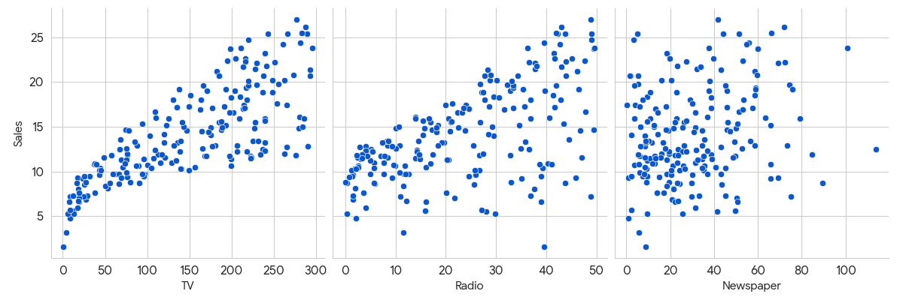

# Sales Prediction Based on Advertising Spend

This is a data science project that aims to predict product sales based on the amount of money spent on advertising through different channels (TV, Radio, and Newspaper).

## Project Goal

The main objective is to understand the relationship between advertising budgets and sales to provide insights that can help in creating more effective marketing strategies.

## Initial Findings

After an initial visual analysis of the data, we found a strong positive relationship between the amount spent on **TV advertising** and sales. Radio advertising also shows a positive correlation, while Newspaper advertising appears to have a much weaker impact.

Here is the chart that visualizes these relationships:



## How to Run This Project

1.  **Make sure you have all the files in the same folder:**
    * `sales_prediction.py` (the main code)
    * `Advertising.csv` (the dataset)

2.  **Run the Python script from your terminal:**
    ```bash
    python sales_prediction.py
    ```
    This will run the analysis, print the model's performance, and generate the chart `sales_vs_advertising_scatter.png`.

## The Data

The dataset used is `Advertising.csv`, which contains 200 records of sales and advertising budgets.
